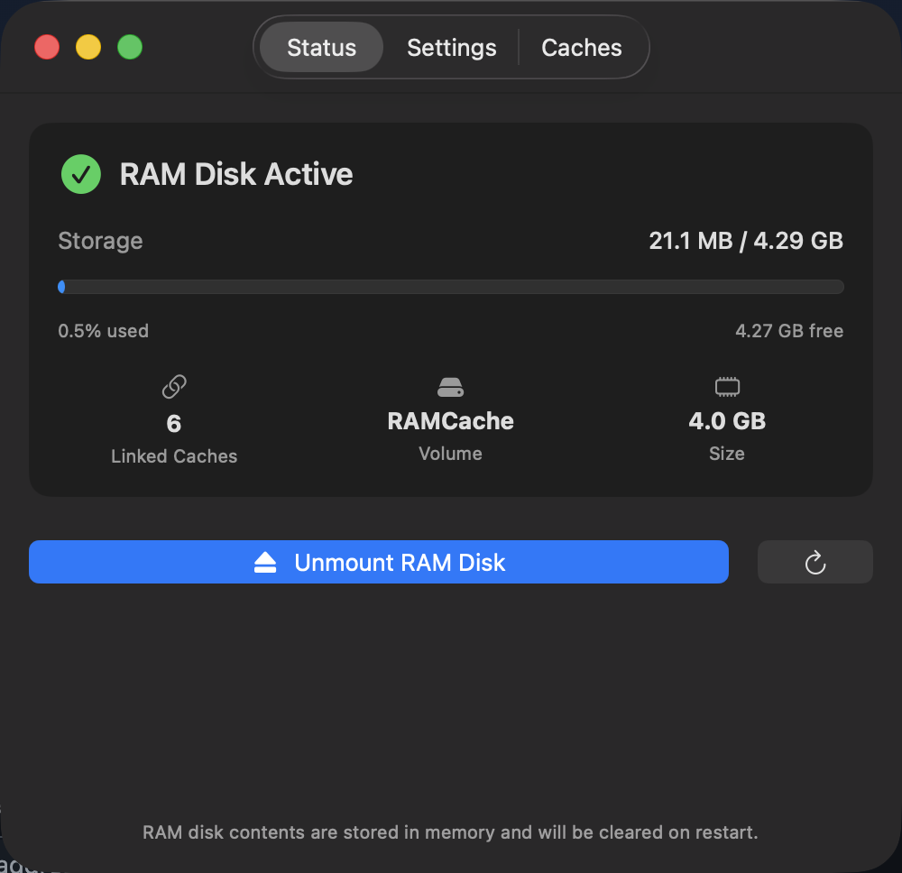
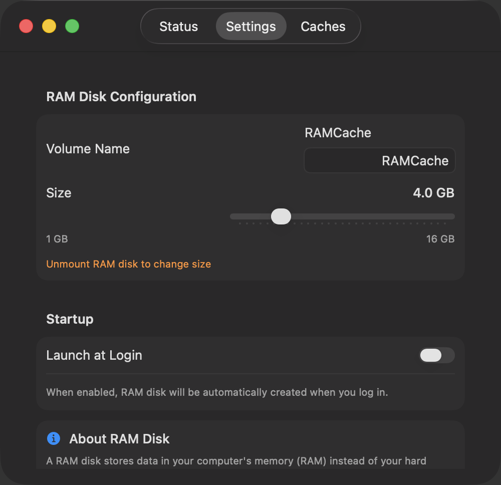
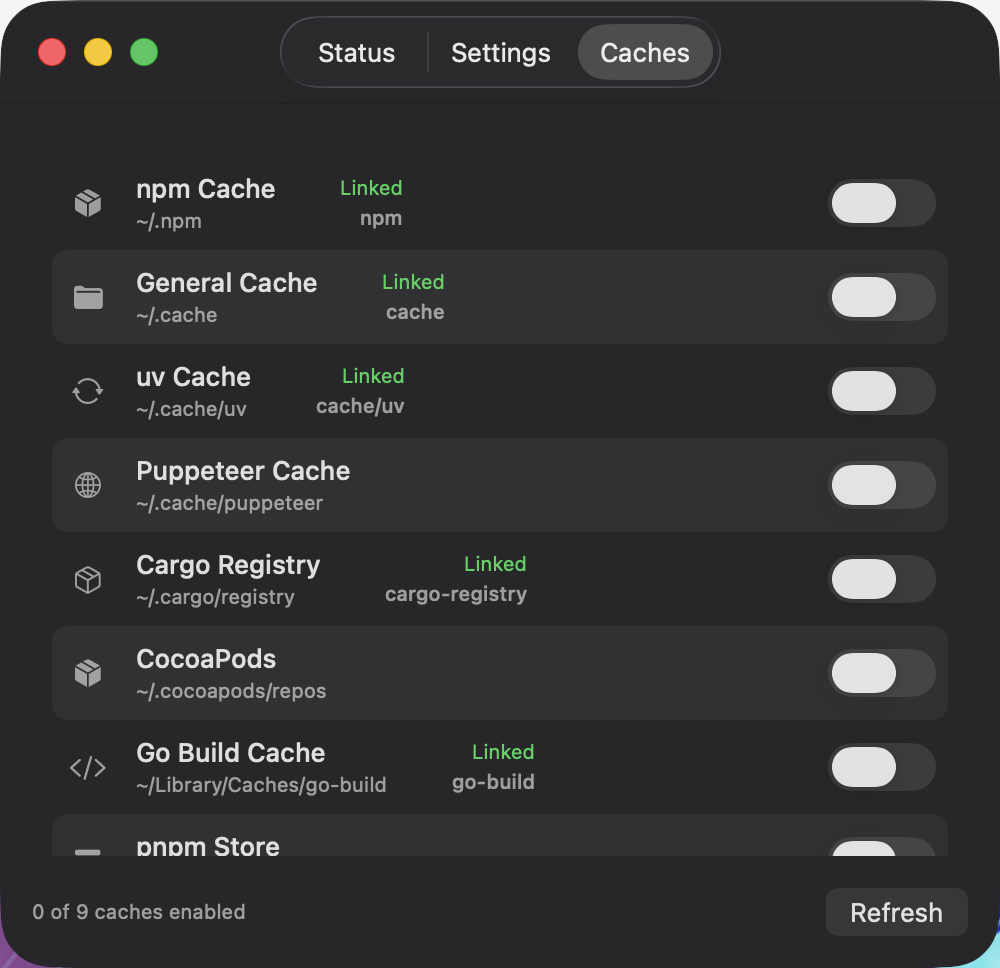

<p align="center">
  
</p>

<h1 align="center">RAMCacheManager</h1>

<p align="center">
  一款原生 macOS 应用，用于管理 RAM 磁盘缓存，加速构建并自动清理。
</p>

<p align="center">
  <a href="https://github.com/talkcozy/RAMCacheManager/releases"></a>
  <a href="LICENSE"></a>
  
  
</p>

<p align="center">
  <a href="README.md">English</a>
</p>

---

## 为什么需要 RAMCacheManager？

npm、Cargo、CocoaPods、Go 等开发工具会在 SSD 上生成大量缓存文件。这些缓存会逐渐拖慢系统、浪费磁盘空间，并缩短 SSD 寿命。

RAMCacheManager 将这些缓存转移到 RAM 磁盘 —— 一个完全存储在内存中的虚拟磁盘：

- **速度提升 10-100 倍** — 内存读写远快于 SSD
- **重启自动清理** — 告别陈旧缓存
- **释放 SSD 空间** — 回收数 GB 磁盘空间
- **延长 SSD 寿命** — 减少不必要的写入

## 截图

| 状态面板 | 设置 | 缓存管理 |
|---------|------|---------|
|  |  |  |

## 功能特性

- **可调节 RAM 磁盘** — 支持 1 GB 到 16 GB 自由调节
- **一键缓存链接** — 通过开关将缓存目录链接到 RAM 磁盘
- **预设缓存目录** — 内置 npm、Cargo、CocoaPods、Go、pnpm 等常用缓存
- **开机自启** — 登录时自动创建 RAM 磁盘
- **菜单栏常驻** — 从菜单栏快速访问
- **实时监控** — 查看 RAM 磁盘使用情况和已链接缓存数量
- **原生 macOS** — 使用 Swift + SwiftUI 构建，轻量高效

## 支持的缓存目录

| 缓存 | 路径 | 说明 |
|------|------|------|
| npm | `~/.npm` | Node.js 包缓存 |
| 通用缓存 | `~/.cache` | XDG 缓存目录 |
| uv | `~/.cache/uv` | Python uv 包管理器 |
| Puppeteer | `~/.cache/puppeteer` | Chromium 浏览器缓存 |
| Cargo | `~/.cargo/registry` | Rust crate 仓库 |
| CocoaPods | `~/.cocoapods/repos` | iOS 依赖规格 |
| Go Build | `~/Library/Caches/go-build` | Go 编译缓存 |
| pnpm | `~/.pnpm-store` | pnpm 内容寻址存储 |
| Dart Pub | `~/.pub-cache` | Dart/Flutter 包缓存 |

## 安装

### 下载 DMG

从 [Releases](https://github.com/talkcozy/RAMCacheManager/releases) 页面下载最新的 `.dmg` 文件。

### 从源码构建

```bash
# 克隆仓库
git clone https://github.com/talkcozy/RAMCacheManager.git
cd RAMCacheManager

# 安装 XcodeGen（如未安装）
brew install xcodegen

# 生成 Xcode 项目并构建
xcodegen generate
xcodebuild -project RAMCacheManager.xcodeproj -scheme RAMCacheManager -configuration Release build
```

## 使用方法

1. 启动 RAMCacheManager
2. 在 **Status** 标签页点击 **Create RAM Disk**
3. 切换到 **Caches** 标签页，开启需要链接的缓存
4. （可选）在 **Settings** 中开启 **Launch at Login**

## 工作原理

```
┌──────────────────────────────────────────┐
│       /Volumes/RAMCache（RAM 磁盘）       │
│  ├── npm/                                │
│  ├── cache/                              │
│  ├── cargo-registry/                     │
│  └── go-build/                           │
└──────────────────────────────────────────┘
                    ▲
                    │  符号链接
                    │
┌──────────────────────────────────────────┐
│  ~/.npm        → /Volumes/RAMCache/npm   │
│  ~/.cache      → /Volumes/RAMCache/cache │
│  ~/.cargo/registry → .../cargo-registry  │
└──────────────────────────────────────────┘
```

重启 Mac 后，RAM 磁盘会自动清空。如果开启了"开机自启"，下次登录时会自动创建新的 RAM 磁盘。

## 系统要求

- macOS 14.0（Sonoma）或更高版本
- Apple Silicon（arm64）

## 许可证

[MIT License](LICENSE)

## 贡献

欢迎提交 Pull Request！
